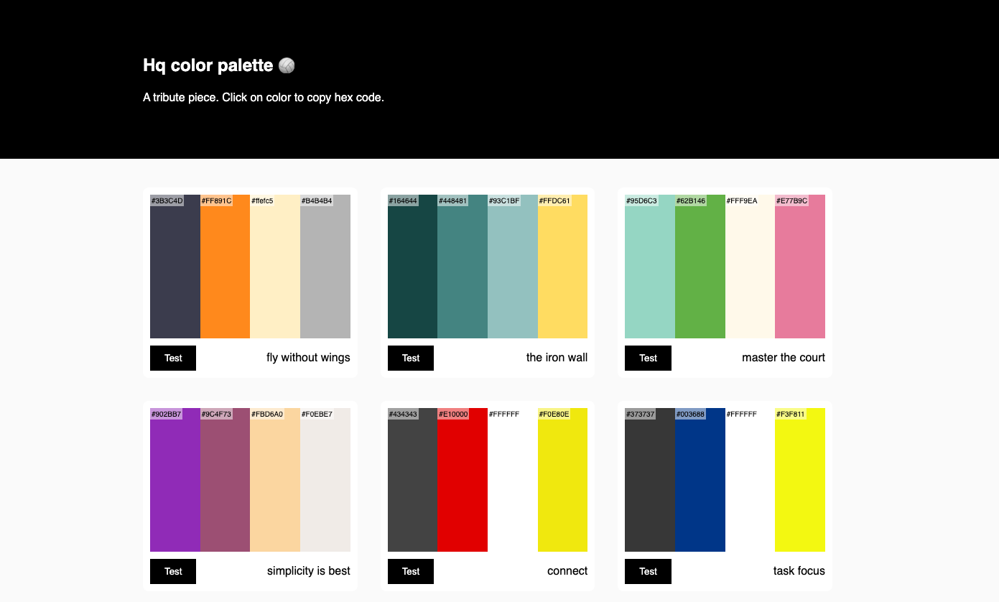

# Haikyuu Palette

## Features 
- color palettes
- test palette on site
- easy copy and paste hex code 

## Built with 
- [Open-wc starter app](https://github.com/open-wc)
- lit element
- Colors by me!

## Deployment
- Deployed on github pages
- Github Actions will build docs folder

<!--
Commands to run:

- `start` runs your app for development, reloading on file changes
- `start:build` runs your app after it has been built using the build command
- `build` builds your app and outputs it in your `dist` directory
- `test` runs your test suite with Karma
- `lint` runs the linter for your project

-->